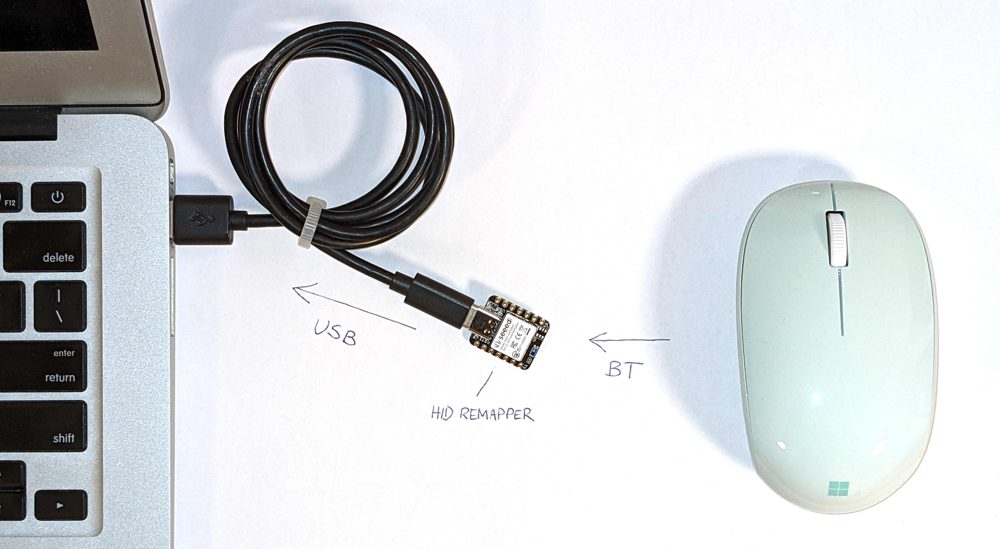

# Bluetooth version

_(Please note this is experimental and hasn't been tested with a lot of devices.)_

There's a special version of the remapper that takes inputs from Bluetooth devices and translates them to USB. It's different from most Bluetooth USB dongles in that from the computer's point of view it is a USB mouse/keyboard, so it requires no special drivers. The remapping functionality works as usual. You can connect multiple devices to it at the same time.

**It only works with Bluetooth Low Energy devices, not Bluetooth Classic.** You can usually tell that a device uses Bluetooth LE if the documentation says it requires Bluetooth version 4 or 5, but some devices say they use Bluetooth 4 or 5 and still use Bluetooth Classic (which technically isn't wrong as Bluetooth Classic is still part of the newer spec).

The Bluetooth version of the remapper runs on Nordic's nRF52840 chip. Currently precompiled binaries are available for the following boards:

* [Adafruit Feather nRF52840 Express](https://www.adafruit.com/product/4062)
* [Seeed Studio Xiao nRF52840](https://www.seeedstudio.com/Seeed-XIAO-BLE-nRF52840-p-5201.html)

To flash the [firmware](firmware-bluetooth), first put the board in flashing mode by double clicking the reset button quickly. A drive should appear on your computer. Copy the [UF2 file that matches your board](https://github.com/jfedor2/hid-remapper/releases/latest) to that drive and that's it. If you want to flash a newer version of the firmware in the future, you can also put the board in firmware flashing mode using the HID Remapper [web configuration tool](https://www.remapper.org/config/).

To connect Bluetooth devices to the remapper, you need to put the device in pairing mode. This is device-specific, but usually involves holding a button for a few seconds. Then you also need to put HID Remapper in pairing mode. You do this by either pressing the "user switch" button on the board or by clicking the "Pair new device" button on the web configuration tool (the Xiao board doesn't have a user button so you have to either do it through the web interface or by shorting pin 0 to GND). The remapper will also automatically enter pairing mode if no devices are currently paired.

You can tell the remapper is in pairing mode if the blue LED is lit constantly. When it's not in pairing mode, the blue LED will be blinking, with the number of blinks per cycle corresponding to the number of currently connected devices.

To make the remapper forget all currently paired devices, hold the "user switch" button for over 3 seconds, or click the "Forget all devices" button on the web configuration tool (or short pin 0 to GND for over 3 seconds on the Seeed Xiao board).

## Known issues

* Quirks mechanism for fixing broken report descriptors doesn't work.
* Reconnects could be faster if we cached attributes/report descriptor.
