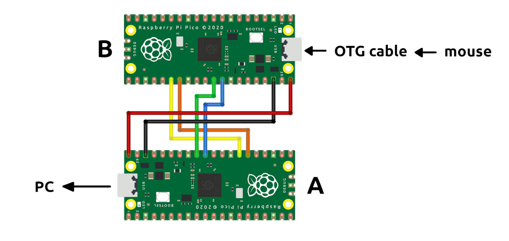
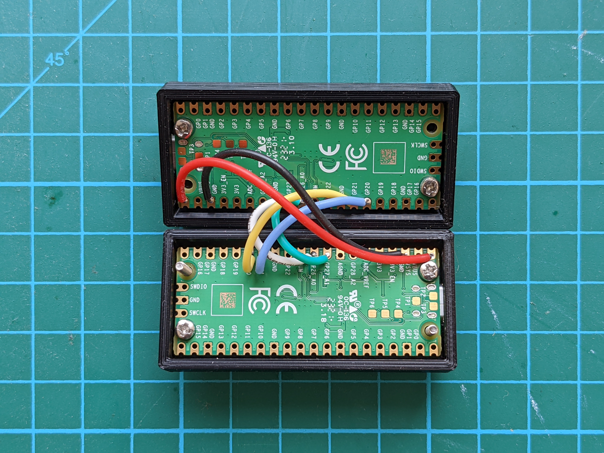
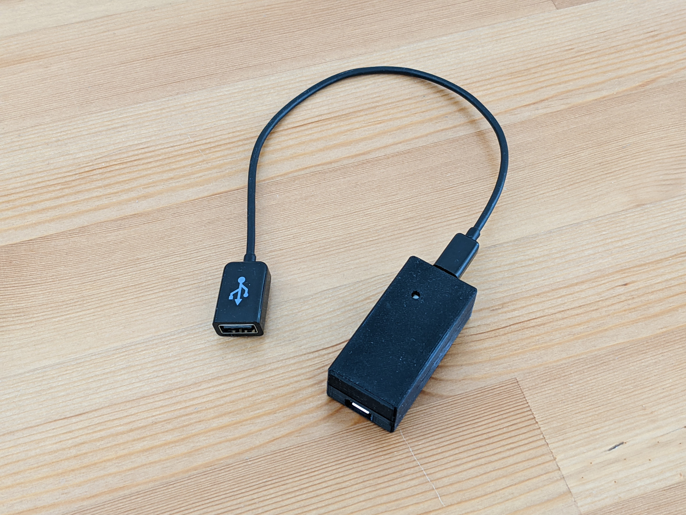

# How to make the Pico variants of the device

This document describes how to make the HID Remapper using a Raspberry Pi Pico (or two). Alternatively, if you don't want to do any soldering, you can have a custom board made at a service like JLCPCB. For more details on this option, see [here](custom-boards/).

There are two variants of the hardware: the single Pico version and the dual Pico version. They have the same functionality, but the dual Pico version has better device compatibility - most input devices work with either, but some will only work with the dual Pico version.

## Single Pico version

This version of the remapper is made using a Raspberry Pi Pico and a USB extension cable cut in half. It is possible thanks to this awesome [Pico-PIO-USB](https://github.com/sekigon-gonnoc/Pico-PIO-USB) library by [sekigon-gonnoc](https://github.com/sekigon-gonnoc). The Pico's built-in USB interface is used to connect to the host computer and the library is used to handle inputs from a USB mouse or keyboard.

Making the device is really simple, you just need to cut a USB extension cable in half and solder four wires to the right pins on the Pico: D+ to GPIO0 (pin 1), D- to GPIO1 (pin 2), VBUS to VBUS (pin 40) and GND to GND (pin 38). The wires are usually color coded (green, white, red, black, respectively). See the pictures below.

The [enclosure](enclosure) folder has 3D-printable files for an optional case, seen in the photo below. It uses four M2x8 flat head screws.

The provided [remapper.uf2](https://github.com/jfedor2/hid-remapper/releases/latest/download/remapper.uf2) file can be used to flash the firmware onto the Pico the usual way (hold BOOTSEL button while connecting to the computer, then copy the UF2 file to the USB drive that shows up).

## Dual Pico version

This version of the remapper uses two Raspberry Pi Picos that talk to each other over serial. One of Picos (B side) receives inputs from a USB mouse via an OTG cable and sends them over the serial link to the other Pico (A side). This Pico processes the configured mappings and sends the resulting inputs to the computer.

You have to solder six wires between the two Picos, connecting the pins as shown below.

| A side | B side |
| -----: | -----: |
| VBUS (pin 40) | VBUS (pin 40) |
| GND (pin 38) | GND (pin 38) |
| GPIO20 (pin 26) | GPIO21 (pin 27) |
| GPIO21 (pin 27) | GPIO20 (pin 26) |
| GPIO26 (pin 31) | GPIO27 (pin 32) |
| GPIO27 (pin 32) | GPIO26 (pin 31) |

There are two firmware files, one for each side. The side that will be connected to the computer has to be flashed with the [remapper\_dual\_a.uf2](https://github.com/jfedor2/hid-remapper/releases/latest/download/remapper_dual_a.uf2) file, and the other side (that you will connect your input devices to using an OTG cable or adapter) has to be flashed with the [remapper\_dual\_b.uf2](https://github.com/jfedor2/hid-remapper/releases/latest/download/remapper_dual_b.uf2) file. Flashing is done the usual way: hold BOOTSEL button while connecting to the computer, then copy the UF2 file to the USB drive that shows up. It is okay to do the flashing after the two Picos are connected as described above, but don't connect both sides to a host at the same time.

The [enclosure](enclosure) folder has 3D-printable files for an optional case, seen in the photo below. It uses four M2x4 screws to attach the Pico boards and two M2x16 flat head screws to keep the two halves together.

