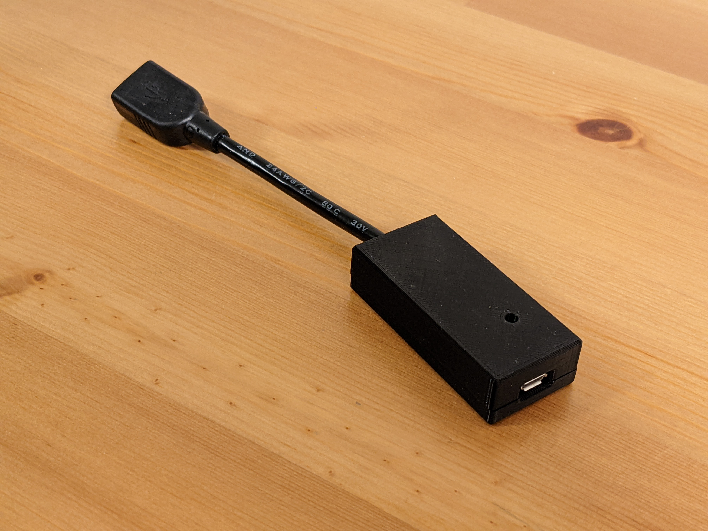

# HID Remapper

This is a configurable USB dongle that allows you to remap inputs from mice, keyboards and other devices. It works completely in hardware and requires no software running on the computer during normal use.

It can do things like reassign buttons, change keyboard layouts, map mouse buttons to keyboard inputs, map keystrokes to mouse inputs, change mouse sensitivity (permanently or when a button is held), rotate mouse axes by arbitrary (non-90 degree) angles, drag-lock for mouse buttons, scroll by moving the mouse, and much more.

It is configurable [through a web browser](https://www.jfedor.org/hid-remapper-config/) using WebHID (Chrome or Chrome-based browser required).

Wireless receivers are supported and multiple devices can be connected at the same time using a USB hub.

In addition to the remapping functionality, it can do polling rate overclocking up to 1000 Hz.

A separate [serial](SERIAL.md) version of the remapper takes inputs from a serial (RS-232) mouse and translates them to USB.

There's also a [Bluetooth](BLUETOOTH.md) version that runs on nRF52840-based boards, which translates Bluetooth inputs to USB.



## How to make the device

There are three main ways of making the HID Remapper. You can either buy [this board](https://www.adafruit.com/product/5723) from Adafruit, make it yourself using a Raspberry Pi Pico (or two), or you can use the provided files to manufacture a custom board at JLCPCB or a similar service. The functionality is the same in all cases.

If you get the Feather RP2040 USB Host board from Adafruit, the device is ready to use, you just need to flash it with the right firmware ([remapper\_feather.uf2](https://github.com/jfedor2/hid-remapper/releases/latest/download/remapper_feather.uf2)). Hold the "Boot" button on the board, then press the "Reset" button. A USB drive should show up on your computer. Copy the UF2 file to that drive. That's it.

See [here](HARDWARE.md) for details on how to make the Pico variants of the device and [here](custom-boards/) for details on the custom board option.

## How to use the configuration tool

A live version of the web configuration tool can be found [here](https://www.jfedor.org/hid-remapper-config/). It only works in Chrome and Chrome-based browsers (including ChromeOS). On Linux you might need to give yourself permissions to the appropriate `/dev/hidraw*` device.

The input remapping mechanism is based on a list of _mappings_. Every mapping has an input and an output. Inputs and outputs are things like mouse buttons, mouse axes, keyboard keys etc. For example if you want the right mouse button to act as the left mouse button, add a mapping with input set to "Right button" and output set to "Left button".

By default all inputs that aren't explicitly mapped to anything are passed through unchanged. If you don't want that, you can uncheck the "Unmapped inputs passthrough" checkbox (for each layer separately, see below).

There can be more than one mapping with the same input and the same output. It is useful when you want to map a mouse button to, say, Ctrl-C. You can achieve that by adding two mappings, both with that button as input, one with "Control" as output and one with "C" as output.

Similarly to remapping buttons, you can also remap axes. For example if you want horizontal mouse movements to be mapped to vertical cursor movements on the computer, add a mapping with the input set to "Cursor X" and the output set to "Cursor Y".

If you want to change cursor speed (mouse sensitivity), you can use the _scaling_ part of the mapping. By default it is set to 1, but you could add mappings with the same axes for inputs and outputs and for example set scaling to 2 to make the cursor move twice as fast, or set it to -1 to invert the direction of the movement. (Usually it's best to first increase the CPI on the device if possible as that will give you better precision.)

You can have a mapping that has a button or a key as input and an axis as output. For example if you add a mapping with "Right arrow" as input and "Cursor X" as output, it will make the cursor move right when right arrow is held on the keyboard.

Having an axis as input and a button as output currently doesn't make a lot of sense.

The _sticky_ flag on a mapping can be used to implement drag-lock functionality. When the flag is enabled on a mapping, pressing (and releasing) the input button will cause the output button to be held until the input button is pressed again.

The _layers_ mechanism might sound familiar if you ever used a custom ergo keyboard. It works as follows. A special mapping can be added with some button as input and "Layer X" as output. This means that when that button is pressed, layer X is active and therefore mappings from layer X are applied. Every mapping has a set of layers on which it is present. If no layer is explicitly activated, layer 0 is active. More than one layer can be active at the same time. This mechanism has many useful applications, from completely separate keyboard layouts to things like "sniper button" on a mouse - increasing precision when a certain button is held.

Layer activating mappings can be sticky.

_Tap-hold_ is another mechanism adopted from the custom ergo keyboard world. It lets you map the same button to different things depending on whether it's _tapped_ (pressed and released quickly) or _held_ (longer than 200ms or whatever you set the threshold to). This allows configurations where a button keeps its primary function when it's clicked, but activates a layer (or a modifier key like Shift) when it's held. Together with the sticky flag, it can also be used to make a button activate a layer permanently when clicked and also temporarily when held. For the last configuration to work properly, create two separate mappings, one with "sticky"+"tap" enabled, and another with "hold" enabled.

Sometimes you want a certain button to send multiple outputs, but not at the same time, but one after another, for example to input a special character by typing something like Alt-0165 or to emulate a double click. You can do that with the _macros_ feature. Each macro is defined as a list of inputs that will be sent one after another. Every input can consist of multiple keys, for example you can have a macro that looks like this: `Left Shift+H, E, L, Nothing, L, O` that will type the string "Hello" or you can have a macro that looks like this: `Left Alt+Numpad 0, Left Alt+Numpad 1, Left Alt+Numpad 6, Left Alt+Numpad 5` that will enter the yen symbol (on some systems). Or, to emulate a double-click, you could define a macro that looks like this: `Left button, Nothing, Left button`. The "Nothing" part is necessary for the computer to register a "button-up" event, otherwise the first macro would type "Helo" and the last one would just work as a single click.

To make a button send a certain macro, add a mapping with that button as input and with "Macro X" as output.

The _expressions_ mechanism is an advanced and experimental feature that can be used for more complex mappings. Among other things it lets you map things like analog sticks, triggers and D-pads on game controllers, applying dead zones and other non-linear transformations to them. See [here](EXPRESSIONS.md) for more info on how to use them.

The configuration tool comes with a list of standard inputs like mouse buttons and axes, keyboard keys and media keys like play/pause, mute, etc. Some devices will use inputs from outside that list. Good news is they can still be mapped. To make the device-specific inputs appear on the list, just connect your device to the remapper, and the remapper to your computer, and click the "Open device" button before you define the mappings. The configuration tool will fetch the list of inputs declared by your device and they will show up at the bottom of the input list. Unfortunately they will only appear as hex codes and will not have human friendly names. Therefore it might require some trial and error to find the input you want (and some devices will have a lot of them!).

The remapper supports high-resolution mouse scrolling on the output side, which should work on Windows and modern Linux desktops. To experience it, add a mapping with "Cursor Y" as input and "V scroll" as output (perhaps on a layer). The "Partial scroll timeout" setting is related to this and you can safely ignore it if you're not mapping anything to mouse scroll. It applies when high-resolution scrolling is _not_ in use and is the time after which a "half-tick" of the scroll is forgotten.

If you set the "Polling rate override" to anything else than "don't override", it will use the selected polling rate instead of the polling rate requested by the connected device. Keep in mind this doesn't work for all devices.

If you're getting an "Incompatible version" error, try upgrading to the newest firmware.

If this description wasn't particularly clear for you, perhaps looking at some of the examples that come with the configuration tool will help.

If you can't use the browser-based configuration tool, there's also a [command-line tool](config-tool) that takes JSON in the same format as the web tool on standard input. I only tested it on Linux, but in theory it should also run on Windows and Mac.

## How to compile the firmware

The easiest way to compile the firmware is to let GitHub do it for you. This repository has GitHub Actions that build the firmware, so you can just fork, make your changes, wait for the job to complete, and look for the binaries in the artifacts produced.

To compile the RP2040 firmware on your machine, use the following steps (details may vary depending on your Linux distribution):

```
sudo apt install gcc-arm-none-eabi libnewlib-arm-none-eabi libstdc++-arm-none-eabi-newlib srecord
git clone https://github.com/jfedor2/hid-remapper.git
cd hid-remapper
git submodule update --init
cd firmware
mkdir build
cd build
cmake ..
# or, to build for the custom boards:
# PICO_BOARD=remapper cmake ..
make
```

To compile the nRF52 firmware, you can either follow [Nordic's setup instructions](https://developer.nordicsemi.com/nRF_Connect_SDK/doc/latest/nrf/getting_started/installing.html) and then `west build -b seeed_xiao_nrf52840` to compile the firmware, or you can use Docker with a command like this (start from the top level of the repository or adjust the path accordingly):

```
docker run --rm -v $(pwd):/workdir/project -w /workdir/project/firmware-bluetooth nordicplayground/nrfconnect-sdk:v2.2-branch west build -b seeed_xiao_nrf52840
```

## License

The software in this repository is licensed under the [MIT License](LICENSE), unless stated otherwise.

The hardware designs in this repository are licensed under the Creative Commons Attribution 4.0 International license ([CC BY 4.0](https://creativecommons.org/licenses/by/4.0/)), unless stated otherwise.
