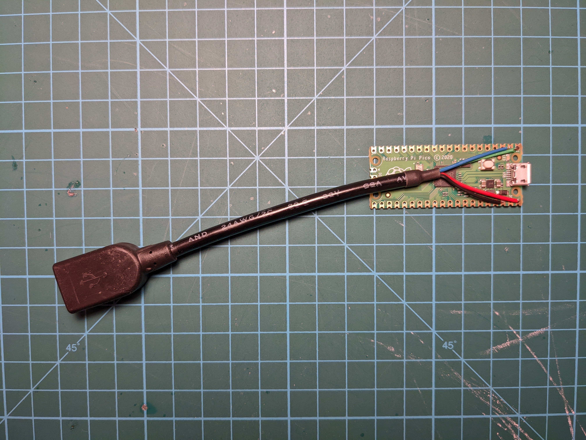
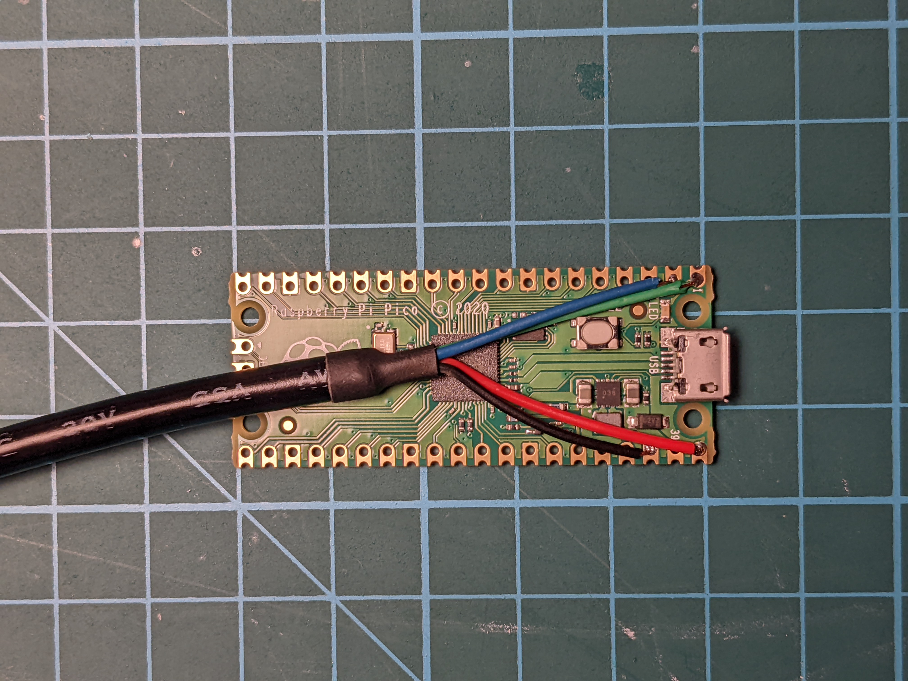

# HID Remapper

This is a configurable USB dongle that allows you to remap inputs from mice, keyboards and other devices. It works completely in hardware and requires no software running on the computer during normal use.

It can do things like reassign buttons, change keyboard layouts, map mouse buttons to keyboard inputs, map keystrokes to mouse inputs, change mouse sensitivity (permanently or when a button is held), rotate mouse axes by arbitrary (non-90 degree) angles, drag-lock for mouse buttons, scroll by moving the mouse, and much more.

It is configurable [through a web browser](https://www.jfedor.org/hid-remapper-config/) using WebHID (Chrome or Chrome-based browser required). Currently it only supports a single input device, but that device can be a keyboard/mouse combo or a wireless receiver with a mouse and a keyboard connected.

In addition to the remapping functionality, it can do polling rate overclocking up to 1000 Hz.

## How to make the device

The remapper is made using a Raspberry Pi Pico and a USB extension cable cut in half. It is possible thanks to this awesome [Pico-PIO-USB](https://github.com/sekigon-gonnoc/Pico-PIO-USB) library by [sekigon-gonnoc](https://github.com/sekigon-gonnoc). The Pico's built-in USB interface is used to connect to the host computer and the library is used to handle inputs from a USB mouse.

Making the device is really simple, you just need to cut a USB extension cable in half and solder four wires to the right pins on the Pico: D+ to GPIO0 (pin 1), D- to GPIO1 (pin 2), VBUS to VBUS (pin 40) and GND to GND (pin 38). The wires are usually color coded (green, white, red, black, respectively). See the pictures at the bottom.

The [enclosure](enclosure) folder has 3D-printable files for an optional case, shown in the photo above. It uses four M2x8 flat head screws.

The provided [UF2 file](firmware/remapper.uf2) can be used to flash the firmware onto the Pico the usual way (hold BOOT button while connecting to the computer, then copy the UF2 file to the USB drive that shows up).

## How to use the configuration tool

A live version of the web configuration tool can be found [here](https://www.jfedor.org/hid-remapper-config/). It only works in Chrome and Chrome-based browsers. Unfortunately it doesn't seem to work on Chrome OS. On Linux you might need to give yourself permissions to the appropriate `/dev/hidraw*` device.

The input remapping mechanism is based on a list of _mappings_. Every mapping has an input and an output. Inputs and outputs are things like mouse buttons, mouse axes, keyboard keys etc. For example if you want the right mouse button to act as the left mouse button, add a mapping with input set to "Right button" and output set to "Left button".

By default all inputs that aren't explicitly mapped to anything are passed through unchanged. If you don't want that, you can uncheck the "Unmapped inputs passthrough" checkbox.

There can be more than one mapping with the same input and the same output. It is useful when you want to map a mouse button to, say, Ctrl-C. You can achieve that by adding two mappings, both with that button as input, one with "Control" as output and one with "C" as output.

Similarly to remapping buttons, you can also remap axes. For example if you want horizontal mouse movements to be mapped to vertical cursor movements on the computer, add a mapping with the input set to "Cursor X" and the output set to "Cursor Y".

If you want to change cursor speed (mouse sensitivity), you can use the _scaling_ part of the mapping. By default it is set to 1, but you could add mappings with the same axes for inputs and outputs and for example set scaling to 2 to make the cursor move twice as fast, or set it to -1 to invert the direction of the movement. (Usually it's best to first increase the CPI on the device if possible as that will give you better precision.)

You can have a mapping that has a button or a key as input and an axis as output. For example if you add a mapping with "Right arrow" as input and "Cursor X" as output, it will make the cursor move right when right arrow is held on the keyboard.

Having an axis as input and a button as output currently doesn't make a lot of sense.

The _sticky_ flag on a mapping can be used to implement drag-lock functionality. When the flag is enabled on a mapping, pressing (and releasing) the input button will cause the output button to be held until the input button is pressed again.

The _layers_ mechanism might sound familiar if you ever used a custom ergo keyboard. It works as follows. A special mapping can be added with some button as input and "Layer X" as output. This means that when that button is pressed, layer X is active and therefore mappings from layer X are applied (every mapping has a layer assigned, 0 by default). If no layer is explicitly activated, layer 0 is active. More than one layer can be active at the same time. This mechanism has many useful applications, from completely separate keyboard layouts to things like "sniper button" on a mouse - increasing precision when a certain button is held.

Layer activating mappings work on all layers, regardless of which layer they are defined on. They can be sticky.

The configuration tool comes with a list of standard inputs like mouse buttons and axes, keyboard keys and media keys like play/pause, mute, etc. Some devices will use inputs from outside that list. Good news is they can still be mapped. To make the device-specific inputs appear on the list, just connect your device to the remapper, and the remapper to your computer, and click the "Open device" button before you define the mappings. The configuration tool will fetch the list of inputs declared by your device and they will show up at the bottom of the input list. Unfortunately they will only appear as hex codes and will not have human friendly names. Therefore it might require some trial and error to find the input you want (and some devices will have a lot of them!).

The remapper supports high-resolution mouse scrolling on the output side, which should work on Windows and modern Linux desktops. To experience it, add a mapping with "Cursor Y" as input and "V scroll" as output (perhaps on a layer). The "Partial scroll timeout" setting is related to this and you can safely ignore it if you're not mapping anything to mouse scroll. It applies when high-resolution scrolling is _not_ in use and is the time after which a "half-tick" of the scroll is forgotten.

If you set the "Polling rate override" to anything else than "don't override", it will use the selected polling rate instead of the polling rate requested by the connected device. Keep in mind this doesn't work for all devices.

If you're getting an "Incompatible version" error, try upgrading to the newest firmware.

If this description wasn't particularly clear for you, perhaps looking at some of the examples that come with the configuration tool will help.

If you can't use the browser-based configuration tool, there's also a [command-line tool](config-tool) that takes JSON in the same format as the web tool on standard input. I only tested it on Linux, but in theory it should also run on Windows and Mac.

## Future goals

* Support multiple devices connected through a USB hub.
* Upstream necessary modifications to the Pico-PIO-USB library.
* Unmapped input passthrough on layers other than 0.
* Runtime-configurable output report descriptor.
* Non-binary absolute usage support (d-pads and joysticks).
* Interactive remapping.
* Explore alternative hardware platforms.
* Test with more devices.
* Bluetooth version.

