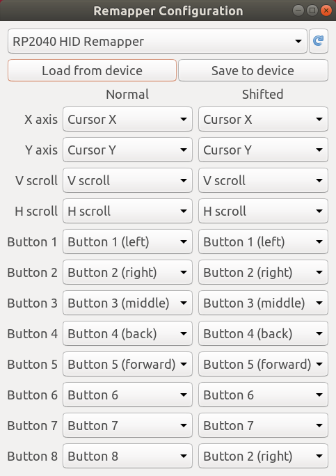

# USB passthrough HID remapper

This is a configurable passthrough USB dongle that allows you to remap mouse inputs. It works completely in hardware and requires no software running on the computer during normal use.

It is configurable either using a desktop GUI application or through a web browser using WebHID. Currently it allows you to remap mouse buttons and axes with some bonus features like click-drag and hold-button-to-scroll.

It is made using a Raspberry Pi Pico and a USB extension cable cut in half. It is possible thanks to this awesome [Pico-PIO-USB](https://github.com/sekigon-gonnoc/Pico-PIO-USB) library by [sekigon-gonnoc](https://github.com/sekigon-gonnoc). The Pico's built-in USB interface is used to connect to the host computer and the library is used to handle inputs from a USB mouse.

Making the device is really simple, you just need to cut a USB extension cable in half and solder four wires to the right pins on the Pico: D+ to GPIO0 (pin 1), D- to GPIO1 (pin 2), VBUS to VBUS (pin 40) and GND to GND (pin 38). The wires are usually color coded (green, white, red, black, respectively). See the pictures at the bottom.

The [enclosure](enclosure) folder has 3D-printable files for an optional case, shown in the photo above. It uses four M2x8 flat head screws.

The provided [UF2 file](firmware/remapper.uf2) can be used to flash the firmware onto the Pico the usual way (hold BOOT button while connecting to the computer, then copy the UF2 file to the USB drive that shows up).

A live version of the web configuration tool can be found [here](https://www.jfedor.org/hid-remapper-config/). (It only works in Chrome and Chrome-based browsers. Unfortunately it doesn't seem to work on Chrome OS. On Linux you might need to give yourself permissions to the appropriate `/dev/hidraw*` device.)

## Short term goals

* Upstream necessary modifications to the Pico-PIO-USB library.
* Sensitivity scaling for mouse axes.
* Test with more devices.

## Long term goals

* Support multiple devices connected through a USB hub.
* Interactive remapping.
* Support more device types, media controls, etc. (on both ends).
* Arbitrary (non-90 degree) axis rotations.
* Explore alternative hardware platforms.
* Test with more devices.

