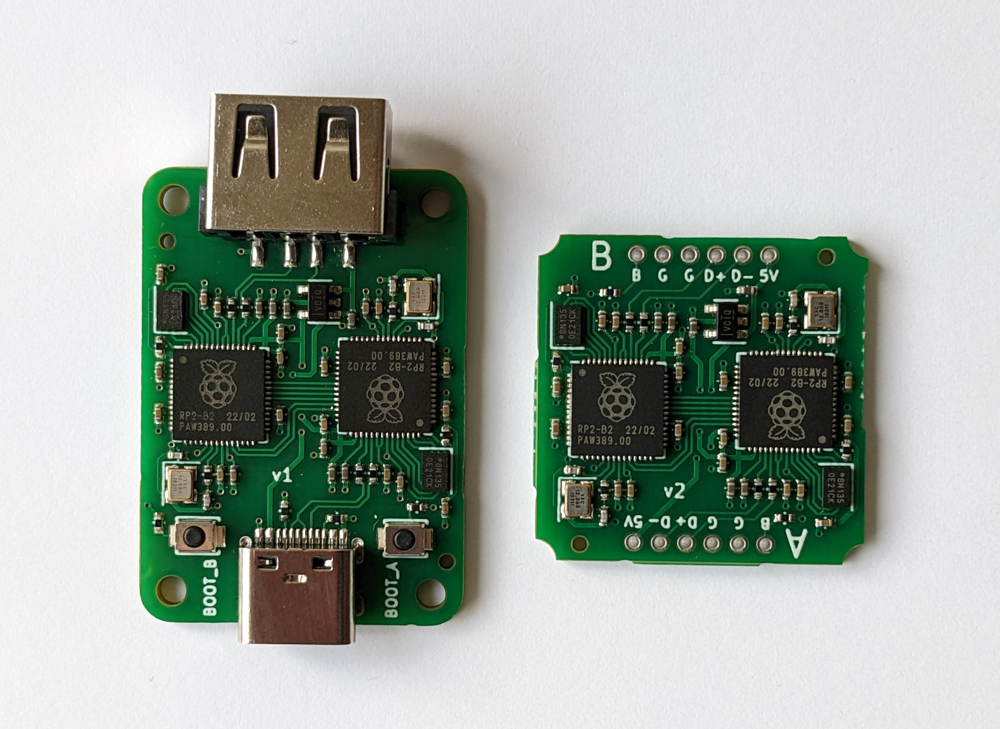

# Custom HID Remapper boards

This document describes how to have custom HID Remapper boards manufactured using the provided design files at a service like JLCPCB. If you'd rather make the device using a Raspberry Pi Pico, see [here](../HARDWARE.md) for details on that option.

There are eight versions, imaginatively named v1-v8. v1, v2, v5, v6 and v7 are equivalent to the dual Pico variant when it comes to internal architecture and device compatibility. v3 and v4 are equivalent to the single Pico variant. v8 uses a single RP2040 chip, but it doesn't have USB inputs.

The main advantage of the v1 board is that it can be made with no soldering, you just order the board, flash the firmware, and have a working device. Files for an optional 3D printable enclosure are also available (it uses M2x8 flat head screws).

The v2 board doesn't have USB connectors and is meant to be built into existing devices like trackballs by soldering the appropriate wires directly to the board.

The v3 board has the form factor of a USB dongle (you plug it directly into your computer).

The v4 board has eight 3.5mm connectors wired to GPIO2-9, meant to be used with external buttons or switches. The 3D printed case for it uses two M2x4 screws and four M3x10 flat head screws.

The v5 board has a built-in four port USB hub. The 3D printed case for it uses one M2x4 screw and four M3x10 flat head screws.

The v6 board has a built-in four port USB hub and eighteen 3.5mm connectors wired to GPIO pins that can be used with external buttons or switches. The 3D printed case for it uses three M2x4 screws and four M3x10 flat head screws.

The v7 board (not pictured above) is a companion device for accessibility controllers like the PlayStation Access and the Xbox Adaptive Controller. It has four analog and ten digital outputs that can be connected to the 3.5mm input ports on those controllers. More information [here](v7).

The v8 board (not pictured above) has one 3.5mm TRRS jack that can be used for analog inputs. For example it could be used to add analog stick inputs to the Hori Flex controller. The jack also works for one or two digital buttons or switches. More information [here](v8).

## How to order the boards

The process of ordering the boards is the same for all versions. You go to JLCPCB's [website](https://jlcpcb.com/), upload the Gerber zip file, enable the "PCB Assembly" option and upload the BOM and CPL files. All the options can be left at their default values. Then click through the rest of the process, making sure that all the components are in stock.

If you want to use some other service than JLCPCB, you will likely need to adapt at least the BOM and CPL files to match their requirements.

## How to flash the firmware

### Firmware flashing mode

v1 and v3-v8 boards have buttons labeled "BOOT\_A" and "BOOT", respectively. These work the same as the BOOTSEL button on a Raspberry Pi Pico. You hold the button while connecting it to a computer to put the board in firmware flashing mode. The v2 board doesn't have a button, but it has the equivalent pin broken out. Short the BOOT pin on the A side to GND while connecting the board to a computer to put it in firmware flashing mode. Then copy the UF2 file to the drive that appears.

If the board is already flashed with some version of the HID Remapper firmware then you can also put it in firmware flashing mode by going to the web config tool and pressing the "Flash firmware" button. This is useful when you want to upgrade the firmware on a device that is not easily accessible.

When the board is fresh from the factory (has never been flashed), it should enter firmware flashing mode automatically when you connect it to a computer with no additional steps necessary.

### v1, v2, v5 and v6

There are two RP2040 chips on each board and each chip has to be flashed with appropriate firmware. The procedure to do it goes as follows:

1. Flash A side (the one that connects to your computer) with [remapper\_board.uf2](https://github.com/jfedor2/hid-remapper/releases/latest/download/remapper_board.uf2) file by putting the board in firmware flashing mode and copying the file to the "RPI-RP2" drive that should appear on your computer.
2. Flash B side by going to the [web config tool](https://www.remapper.org/config/), opening the device and pressing the "Flash B side" button. When you do this, the A side flashes the B side with the appropriate firmware (there's no separate UF2 file).

In the future, I'd like to remove the need for step 2, it should be possible to make it happen automatically.

### v7

The procedure for the v7 board is the same as for v1, v2, v5 and v6, but you need to use the [remapper\_board\_v7.uf2](https://github.com/jfedor2/hid-remapper/releases/latest/download/remapper_board_v7.uf2) firmware file.

### v3 and v4

Flash the board with [remapper\_feather.uf2](https://github.com/jfedor2/hid-remapper/releases/latest/download/remapper_feather.uf2) file by putting it in firmware flashing mode and copying the file to the "RPI-RP2" drive that should appear on your computer.

### v8

Flash the board with [remapper\_board\_v8.uf2](https://github.com/jfedor2/hid-remapper/releases/latest/download/remapper_board_v8.uf2) file by putting it in firmware flashing mode and copying the file to the "RPI-RP2" drive that should appear on your computer.

## Acknowledgements

v1, v4, v5, v6 and v7 PCB designs use [Type-C.pretty](https://github.com/ai03-2725/Type-C.pretty) library by [ai03-2725](https://github.com/ai03-2725).
