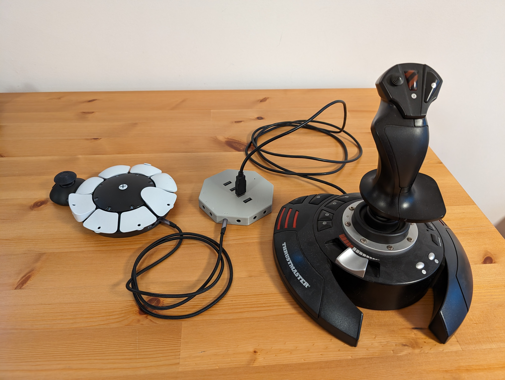
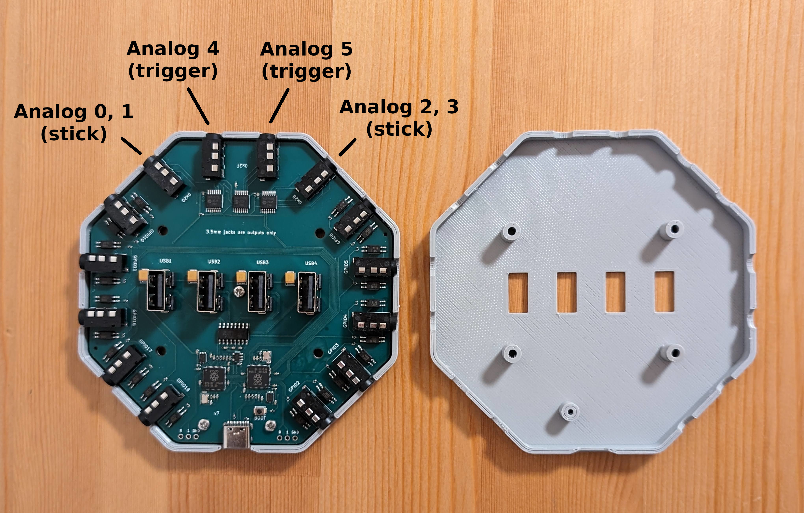

# HID Remapper custom board v7

This variant of HID Remapper is meant to be a companion device for accessibility controllers like the PlayStation Access controller and the Xbox Adaptive Controller, especially the former, since it lacks its own USB inputs.

It has fourteen 3.5mm output ports, four of which are analog outputs. Two of the analog outputs can be used for analog sticks and the other two for analog triggers.

The way it would typically be used is you would plug some USB input device like a joystick into one of the USB ports and then configure HID Remapper to map the axes from this joystick to analog outputs. Then you would connect the analog output port on HID Remapper to a 3.5mm input port on the PlayStation Access controller with a TRRS cable. Similarly you could map buttons on your joystick to digital HID Remapper outputs (GPIOs). The ports on the PlayStation Access controller can all work as joysticks, triggers and buttons, but on HID Remapper you have to use the dedicated ports for each.

In this case the USB-C port on HID Remapper is only used for powering it and configuration. It has to be plugged into something for the device to have power, but it doesn't have to be your PS5. You can have it plugged into a PC and change the configuration on the fly, while testing it on your console in real time.

Of course you can make use of all the mapping capabilities of HID Remapper, you can connect multiple USB devices, including mice and keyboards, and configure the mappings the way you like. The only limitation is that the PlayStation Access controller only has four 3.5mm ports so even you have two of them, you're still limited to eight ports in total.

The 3D printed case uses three M2x4 screws and four M3x10 flat head screws.
