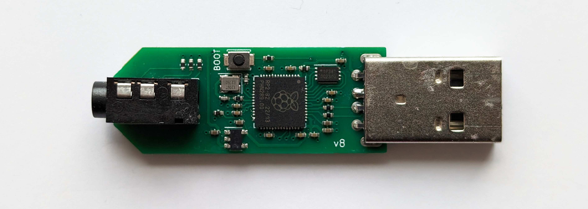

# HID Remapper custom board v8



This variant of HID Remapper doesn't have USB inputs, it only has one 3.5mm TRRS jack. It can be used to connect an analog joystick or trigger (and also one or two digital buttons or switches).

It could be used to add analog stick inputs to the Hori Flex controller or for any type of input when plugged into a computer.

Because different devices will have different ranges and possibly neutral points, you will need to use expressions to scale the readings from the analog inputs to whatever range is expected by the outputs you want to map them to. Use the "Monitor" tab to check what raw values HID Remapper is getting from your joystick or other analog device.

The two analog values are exposed as usages 0xfff80000 and 0xfff80001.

So for example if your joystick sits around 2000 when neutral and goes from 500 to 3500 when moved, you could use an expression like this for one of its axes:

```
0xfff80000 input_state 
-2000 add 
0.085 mul
128 add
0 255 clamp
```

You might want to add some deadzone handling. Check the "Examples" tab for a complete configuration.
